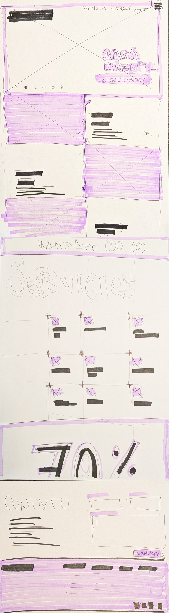

## What the Project Is

This project is a full redesign and technical relaunch of jmasrarquitectos.com, an architecture studio site. The original site is being rebuilt from the ground up (every page redesigned) and paired with a headless CMS so projects can be added and updated through a simple admin interface instead of editing code. Built as a final project for neue fische's Web Development & AI Bootcamp.

## Tech Stack

- Next.js
- Tailwind CSS
- Payload CMS
- MongoDB (Atlas)
- Deployed on Vercel

## How to Run It Locally

```bash
git clone git@github.com:josereyes11/jmasr_arquitectos.git
cd jmasr_arquitectos
npm install
```

Create a `.env.local` file in the root with your CMS credentials:

DATABASE_URL=your_mongodb_connection_string_here
PAYLOAD_SECRET=your_payload_secret_here

Start the dev server:

```bash
npm run dev
```

Then open http://localhost:3000, or http://localhost:3000/admin to log in to the CMS.

## Design Process


